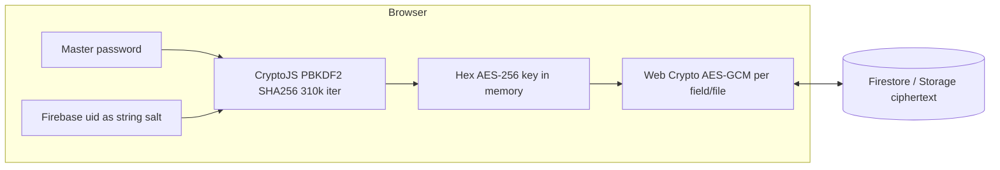

# Client-side crypto hardening with strict backward compatibility

## Priority: zero feature loss

This work is **internal hardening** (worker + tests + hygiene). It must **not** remove, rename, or change semantics of any behavior users rely on today.

- **Frozen public contract:** [authStore.ts](c:\Users\lleep\Projects\api-manager\src\stores\authStore.ts) must keep the same Zustand surface for consumers: `encryptionKey`, `masterPasswordSet`, `setMasterPassword` (async, same success/error/localStorage hash side-effects), `openMasterPasswordModal` / `closeMasterPasswordModal`, `clearEncryptionKey`, `lockNow`, idle and visibility-based auto-lock, and PW-route behavior wired from [App.tsx](c:\Users\lleep\Projects\api-manager\src\App.tsx). Pages and stores must not need refactors except where they already call `setMasterPassword` (still one promise, still sets the same state).
- **No UX regressions:** Master password modal timing, “locked” empty states, and “open modal to continue” flows stay as they are on dashboard, project detail, credentials, import, files, global search, and encryption status.
- **Password app (`/pw`):** [passwordStore.ts](c:\Users\lleep\Projects\api-manager\src\stores\passwordStore.ts) uses `useAuthStore.getState().encryptionKey` **or** internal PW key helpers (`_getOrInitPwKey`, `_peekPwKey`). Hardening must not break encrypt/decrypt of stored passwords when the main app key is set or when PW-only paths apply.
- **If a worker fails:** Fallback or error handling must still allow unlock (same end state as today); do not ship a path where `setMasterPassword` succeeds in main thread but fails in worker without recovery, or vice versa, with divergent keys.

## Direction (confirmed)

You chose **not** to move master password / PBKDF2 / AES-GCM to Vercel. That preserves the current **zero-knowledge / browser-only** model reflected in copy on [HomePage.tsx](c:\Users\lleep\Projects\api-manager\src\pages\HomePage.tsx) and [PaywallPage.tsx](c:\Users\lleep\Projects\api-manager\src\pages\PaywallPage.tsx). This plan **does not** add server-side decryption or send the master password to `/api`.

## How crypto works today (source of truth)

| Layer            | Location                                                                                        | Details                                                                                                           |
| ---------------- | ----------------------------------------------------------------------------------------------- | ----------------------------------------------------------------------------------------------------------------- |
| Key derivation   | [authStore.ts](c:\Users\lleep\Projects\api-manager\src\stores\authStore.ts) `setMasterPassword` | `CryptoJS.PBKDF2(password, user.uid, { hasher: SHA256, iterations: 310000, keySize: 256/32 })` → `.toString(Hex)` |
| Bulk encryption  | [encryptionService.ts](c:\Users\lleep\Projects\api-manager\src\services\encryptionService.ts)   | `crypto.subtle` **AES-GCM**, 12-byte IV, IV sent as base64; ciphertext blobs base64-stored in Firestore           |
| Legacy read path | [credentialStore.ts](c:\Users\lleep\Projects\api-manager\src\stores\credentialStore.ts)         | **CryptoJS AES-CBC** + hex IV for old rows (`decryptCBC`, `isLegacyHexIV`) — must remain behavior-identical       |

**Important:** Only **hashes** of the derived key and master password are written to `localStorage` (base64-wrapped); the **raw hex key lives in Zustand memory** only. No migration of “stored keys” is required for compatibility—compatibility means **same password + same uid ⇒ same derived key ⇒ same decrypt** for all existing ciphertext.

## Feature surface inventory (scan — must not regress)

These files depend on `encryptionKey`, `masterPasswordSet`, or modal actions; all flows should appear in the manual QA matrix after implementation.

| Area              | File(s)                                                                                                                                                                                  | What to preserve                                                                                                                |
| ----------------- | ---------------------------------------------------------------------------------------------------------------------------------------------------------------------------------------- | ------------------------------------------------------------------------------------------------------------------------------- |
| Shell / gating    | [App.tsx](c:\Users\lleep\Projects\api-manager\src\App.tsx), [MasterPasswordModal.tsx](c:\Users\lleep\Projects\api-manager\src\components\auth\MasterPasswordModal.tsx)                   | Auto-open modal when logged in without master session (non-PW routes); explicit open/close; `setMasterPassword` submit behavior |
| Dashboard         | [DashboardPage.tsx](c:\Users\lleep\Projects\api-manager\src\pages\DashboardPage.tsx)                                                                                                     | Project fetch gated on `masterPasswordSet`; locked empty state + `openMasterPasswordModal`                                      |
| Project detail    | [ProjectDetailPage.tsx](c:\Users\lleep\Projects\api-manager\src\pages\ProjectDetailPage.tsx)                                                                                             | Credential fetch when `masterPasswordSet && encryptionKey && projectId`; locked UI + modal                                      |
| All credentials   | [CredentialsPage.tsx](c:\Users\lleep\Projects\api-manager\src\pages\CredentialsPage.tsx)                                                                                                 | Fetch after unlock; post-delete refresh; locked state                                                                           |
| Import            | [ImportProjectPage.tsx](c:\Users\lleep\Projects\api-manager\src\pages\ImportProjectPage.tsx)                                                                                             | Import actions require `masterPasswordSet` and `encryptionKey`; opens modal when missing                                        |
| Files             | [FileUploadArea.tsx](c:\Users\lleep\Projects\api-manager\src\components\files\FileUploadArea.tsx), [FileList.tsx](c:\Users\lleep\Projects\api-manager\src\components\files\FileList.tsx) | Encrypt toggle tied to `masterPasswordSet`; encrypted download prompts modal if no key; decrypt path in store                   |
| Search            | [GlobalSearchBar.tsx](c:\Users\lleep\Projects\api-manager\src\components\layout\GlobalSearchBar.tsx)                                                                                     | Index refresh when key available; hints when tokens present but locked; open modal from UI                                      |
| Status            | [EncryptionStatusIndicator.tsx](c:\Users\lleep\Projects\api-manager\src\components\auth\EncryptionStatusIndicator.tsx)                                                                   | Locked vs unlocked; open modal to unlock                                                                                        |
| Data: credentials | [credentialStore.ts](c:\Users\lleep\Projects\api-manager\src\stores\credentialStore.ts)                                                                                                  | All GCM paths + legacy CBC read/write branches + `resetCorruptedCredential` / import paths                                      |
| Data: files       | [fileStore.ts](c:\Users\lleep\Projects\api-manager\src\stores\fileStore.ts)                                                                                                              | Encrypted upload/download; errors when encrypt requested without key                                                            |
| Data: PW app      | [passwordStore.ts](c:\Users\lleep\Projects\api-manager\src\stores\passwordStore.ts)                                                                                                      | `encryptWithKey` / `decryptWithKey` with main `encryptionKey` or PW key fallback                                                |

## Backward compatibility rules (non-negotiable)

1. **Frozen KDF inputs and parameters** until an explicit versioned migration exists: password string, salt string **exactly** `user.uid` (same JS string CryptoJS uses today), 310000 iterations, SHA-256 PRF, 256-bit key length, hex encoding of key for `importKey` in [encryptionService.ts](c:\Users\lleep\Projects\api-manager\src\services\encryptionService.ts).
2. **Frozen AES-GCM wire format:** 12-byte IV, same `subtle.encrypt` / `subtle.decrypt` usage, same base64 IV encoding, same storage of ciphertext (base64 blobs) as today.
3. **Legacy CBC:** Keep decrypt-only paths and detection unchanged; do not remove `CryptoJS` from the bundle while any user may still have legacy documents.
4. **Prove equality before shipping refactors:** add **golden-vector tests** (see below) that assert derived key hex and a round-trip AES-GCM ciphertext match **pre-recorded vectors** from the current implementation. Any change that fails these tests is a release blocker.

## Hardening work (compatible by design)

### 1. Offload PBKDF2 to a Web Worker (recommended primary change)

- **Why:** Same security model, but avoids multi-second main-thread freeze in [authStore.ts](c:\Users\lleep\Projects\api-manager\src\stores\authStore.ts) (PBKDF2 is synchronous today).
- **How to preserve keys:** Run **the same CryptoJS PBKDF2 call** inside the worker (bundle `crypto-js` into worker entry or use `importScripts` pattern Vite supports). **Do not** switch to `crypto.subtle.deriveBits` for PBKDF2 unless golden tests prove **bit-for-bit** identity with CryptoJS for salt = uid string—CryptoJS string/salt encoding is easy to get wrong.
- **API:** `setMasterPassword` resolves a promise from the worker result; store shape (`encryptionKey`, `masterPasswordSet`, localStorage hash writes) stays the same.

### 2. Golden-vector and regression tests

- Add a small test file (e.g. Vitest) or a dev-only script that:
  - Uses a fixed `uid` string + fixed `password` and asserts **derived key hex** matches a committed golden value generated once from the **current** app.
  - Asserts **AES-GCM** encrypt/decrypt round-trip for a known plaintext blob using that key (IV can be fixed for test by mocking `getRandomValues` or testing only decrypt of a fixed vector).
  - Asserts **legacy CBC** decrypt for a fixed ciphertext + hex IV + key (optional but valuable).
- Run in CI on `npm run build` or a dedicated `npm test` so regressions cannot merge silently.

### 3. Tighten operational hygiene (no algorithm change)

- Audit [MasterPasswordModal.tsx](c:\Users\lleep\Projects\api-manager\src\components\auth\MasterPasswordModal.tsx) and related logging so the master password never hits analytics/console.
- Prefer `globalThis.btoa` / `atob` or Buffer-free helpers in [encryptionService.ts](c:\Users\lleep\Projects\api-manager\src\services\encryptionService.ts) where `window` is assumed, so the same module can run in a worker if you later move GCM there—**behavior must stay identical** on main thread first.

### 4. Optional later: AES-GCM in a dedicated worker

- Only after PBKDF2 worker is stable; same `encryptionService` logic moved verbatim; again gated by golden tests. Not required for the first slice.

## Explicitly out of scope (per your choice)

- Vercel Functions that accept master password or derived key.
- Changing Firestore field names or ciphertext layouts.
- Re-encrypting all user data “for migration” unless you later add a **separate**, opt-in version bump project with its own plan.

## Risk note (product truth)

Hardening improves **availability and some XSS ergonomics** (shorter main-thread stalls); it does **not** remove the need to trust the user’s browser for E2E. That stays aligned with your current marketing.

## Implementation order

1. Add golden-vector fixtures + test runner (Vitest is typical for Vite).
2. Introduce PBKDF2 worker + wire `setMasterPassword` through it; keep synchronous fallback behind a feature flag **only in dev** if needed, default production path = worker.
3. **Regression pass (feature-complete):** walk the inventory table above — not only crypto correctness but **every** gated fetch, button disabled state, modal trigger, and PW app encrypt/decrypt. Explicit checks:
   - **Credentials:** GCM document (per-field IVs) + at least one **legacy CBC** row: view, edit, save, `resetCorruptedCredential` if applicable.
   - **Files:** upload with encryption on/off; download encrypted file after unlock; confirm `FileList` retry-after-unlock still runs.
   - **Import:** run import only after unlock; confirm modal opens when locked (ImportProjectPage effect).
   - **Search:** type query with session locked vs unlocked; refresh index after unlock.
   - **Session policies:** idle timeout and long background tab still invoke `lockNow` / `clearEncryptionKey` as today; after re-login + master password, data decrypts again.
