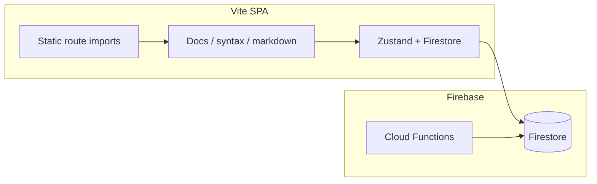

# Performance optimization opportunities

## Context

This repo is a **Vite 6 + React 19 + React Router 7 + Firebase** SPA (not Next.js). The performance-optimizer pass mapped the stack from [`package.json`](c:\Users\lleep\Projects\api-manager\package.json), [`vite.config.ts`](c:\Users\lleep\Projects\api-manager\vite.config.ts), and [`firebase.json`](c:\Users\lleep\Projects\api-manager\firebase.json) (`functions` → `functions/`). Findings below are prioritized by typical **FCP/LCP/TTI/INP** and **Firestore latency** impact.

---

## Quick wins (do first)

1. **Route-level code splitting** — [`src/App.tsx`](c:\Users\lleep\Projects\api-manager\src\App.tsx) statically imports every page (lines 1–36). There is **no** `React.lazy` / `lazy(` anywhere under [`src/`](c:\Users\lleep\Projects\api-manager\src). **Action:** Wrap route `element`s in `React.lazy` + `Suspense` (fallback can match existing loading UX), starting with rarely used trees: docs, billing, import, profile, password sub-app if feasible.

2. **Lazy-load heavy markdown/syntax stacks** — Doc and preview routes pull **`react-markdown`**, **`react-syntax-highlighter`**, **rehype/remark** (per audit: [`src/pages/DocDetailPage.tsx`](c:\Users\lleep\Projects\api-manager\src\pages\DocDetailPage.tsx), [`src/components/files/FilePreviewModal.tsx`](c:\Users\lleep\Projects\api-manager\src\components\files\FilePreviewModal.tsx)). **Action:** Either lazy the whole page route or `import()` the editor stack when the user opens that UI.

3. **Parallelize Firestore project loops** — Sequential `await getDocs` inside `for` over projects inflates tail latency. **Action:** Replace with `Promise.all` (optionally with a small concurrency cap) in [`src/stores/fileStore.ts`](c:\Users\lleep\Projects\api-manager\src\stores\fileStore.ts) (`fetchAllFilesForUser` pattern) and the analogous loop in [`src/stores/credentialStore.ts`](c:\Users\lleep\Projects\api-manager\src\stores\credentialStore.ts) (`loadAllDecryptedCredentialsForUser`).

4. **Memoize stable derived lists** — [`src/components/credentials/CredentialsView.tsx`](c:\Users\lleep\Projects\api-manager\src\components\credentials\CredentialsView.tsx): `[...credentials].sort(...)` on every render. **Action:** `useMemo` keyed on `credentials` (or sort once upstream).

5. **Font loading: single source of truth** — Audit flagged overlap between [`index.html`](c:\Users\lleep\Projects\api-manager\index.html), [`src/main.tsx`](c:\Users\lleep\Projects\api-manager\src\main.tsx) (`document.fonts.load`), and [`src/index.css`](c:\Users\lleep\Projects\api-manager\src\index.css). **Action:** Pick self-hosted WOFF2 + `@font-face` _or_ Google Fonts links; remove redundant waits/duplicate declarations to reduce **FOUT/CLS** risk.

6. **Dependency hygiene** — Root [`package.json`](c:\Users\lleep\Projects\api-manager\package.json) includes **`cmdk`**, **`stripe`**, **`firebase-admin`**, **`sharp`** alongside client deps; subagent found **no `src/` imports** for `stripe`/`cmdk`. **`firebase-admin`** belongs in [`functions/package.json`](c:\Users\lleep\Projects\api-manager\functions\package.json) only unless a root script truly needs it. **`sharp`** is tooling (`src/utils/image-resizer.js` pattern)—prefer **devDependencies** or a scripts package. **Action:** Remove unused deps; split server/tooling deps to shrink install and avoid accidental client bundling.

---

## Medium effort

- **Password list:** Dev-gate or remove logging `useEffect` tied to `passwords`/`items` in [`src/components/pw/PasswordList.tsx`](c:\Users\lleep\Projects\api-manager\src\components\pw\PasswordList.tsx); consider **virtualization** if lists are large.
- **Bulk delete:** Sequential `await` in bulk paths (same file per audit)—batch Firestore writes or parallelize with a concurrency limit + progress UI.
- **Zustand persist:** Throttle or `partialize` for [`src/stores/recentItemsStore.ts`](c:\Users\lleep\Projects\api-manager\src\stores\recentItemsStore.ts) if writes happen often (sync JSON to `localStorage`).
- **Cloud Function `pw_mergeTags`:** If it does `col.get()` and scans all passwords ([`functions/index.js`](c:\Users\lleep\Projects\api-manager\functions\index.js)), replace with targeted queries (`array-contains`) + composite indexes as needed.
- **Idle listeners:** [`src/stores/authStore.ts`](c:\Users\lleep\Projects\api-manager\src\stores\authStore.ts) includes `scroll` in activity events—drop or throttle if profiling shows jank.

---

## Larger refactors (after measurement)

- **Main-thread crypto:** `CryptoJS.PBKDF2` / decrypt paths (e.g. [`src/stores/authStore.ts`](c:\Users\lleep\Projects\api-manager\src\stores\authStore.ts))—move KDF toward **Web Crypto** and/or a **Worker** to protect **INP**.
- **Sequential decrypt in password fetch:** [`src/stores/passwordStore.ts`](c:\Users\lleep\Projects\api-manager\src\stores\passwordStore.ts) `for` + `await decryptWithKey` per doc—bounded concurrency or decrypt-on-visible-rows (product tradeoff).
- **Denormalized indexes:** Reduce cross-project N+1 for global search with a flat collection or maintained index (bigger data model change).

---

## Processes / CI

- **No repo-hosted workflows** under `.github/workflows/` (only under `node_modules`). **Action:** If you rely on CI elsewhere, document cache steps (`npm ci`, npm cache, Vite cache). If not, add a minimal workflow: lint + `npm run build` with dependency caching.

---

## How to validate (before/after)

1. **`vite build`** + bundle visualizer (e.g. `rollup-plugin-visualizer`) after route splits—confirm chunk boundaries.
2. **Chrome Performance + Lighthouse** on `vite preview` (throttled) for **LCP/INP** and long tasks during unlock, large project load, doc open.
3. **Firebase Performance** or custom timings around the stores that load many projects (files/credentials/passwords) for **p95** in production.

---

## Out of scope unless you migrate

Next.js-specific optimizations (`next/image`, Cache Components, etc.) do **not** apply to this Vite SPA unless you change frameworks.
