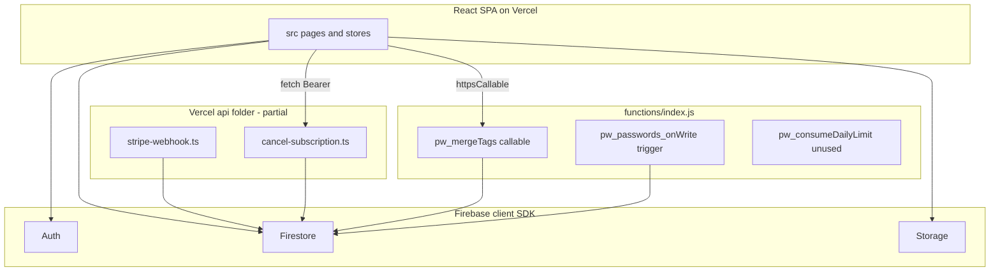
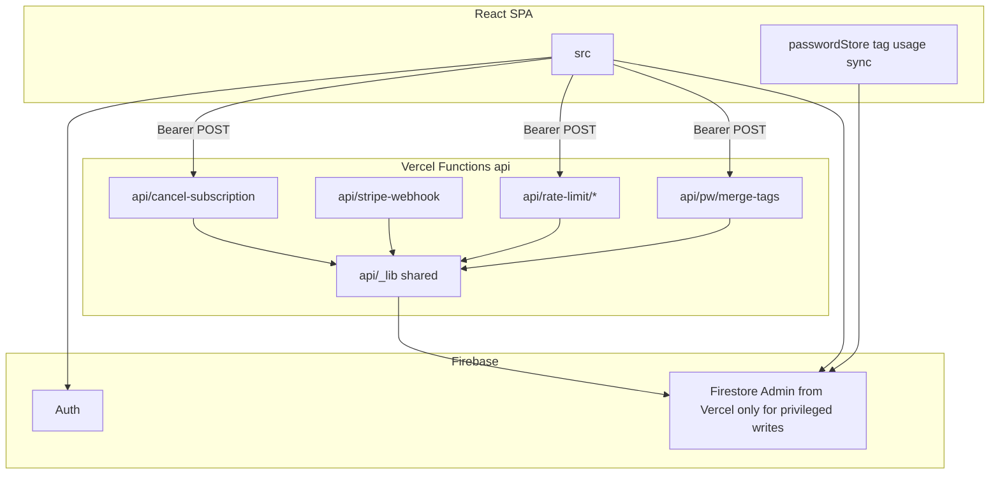

# Migrate backend to Vercel Functions

## Current architecture



**Already on Vercel:** [api/stripe-webhook.ts](api/stripe-webhook.ts), [api/cancel-subscription.ts](api/cancel-subscription.ts) (wired via [vercel.json](vercel.json) `/api/*` rewrite).

**To migrate from Firebase:** `pw_mergeTags` (used by [src/stores/tagStore.ts](src/stores/tagStore.ts)), `pw_passwords_onWrite` (you chose **client-side replacement**), `pw_consumeDailyLimit` (**unused** — client [rateLimitStore.ts](src/stores/rateLimitStore.ts) already writes `dailyLimits` directly; `checkAndConsumeDaily` is never called).

**Stays client → Firebase (not “backend ops”):** credential/project/file CRUD, encryption (browser-only per prior hardening), Auth. No change to E2E crypto model.

---

## Target architecture



---

## Phase 1 — Shared API foundation

Create reusable server modules (avoid duplicating Admin init in each route):

| File                                                      | Role                                                                                                                                                                        |
| --------------------------------------------------------- | --------------------------------------------------------------------------------------------------------------------------------------------------------------------------- |
| [api/\_lib/firebase-admin.ts](api/_lib/firebase-admin.ts) | Singleton `firebase-admin` init (service account JSON env or `applicationDefault()` — align with existing [api/cancel-subscription.ts](api/cancel-subscription.ts) pattern) |
| [api/\_lib/verify-auth.ts](api/_lib/verify-auth.ts)       | `Authorization: Bearer <Firebase ID token>` → `{ uid }`                                                                                                                     |
| [api/\_lib/http.ts](api/_lib/http.ts)                     | JSON responses, method guards, error mapping                                                                                                                                |

**Dependencies:** Add to root [package.json](package.json) (currently missing but required by `api/*`):

- `firebase-admin`
- `stripe`
- `@vercel/node` (types for existing handlers)

**Typecheck:** Extend [tsconfig.api.json](tsconfig.api.json) to include `api/_lib/**`.

---

## Phase 2 — Migrate `pw_mergeTags` → Vercel

- **New route:** `api/pw/merge-tags.ts` — `POST` only; verify auth; port logic from [functions/index.js](functions/index.js) lines 88–123 (batch password updates + tag transaction).
- **Client:** Update [src/stores/tagStore.ts](src/stores/tagStore.ts) `mergeTags` to:

```ts
const token = await user.getIdToken();
await fetch("/api/pw/merge-tags", {
  method: "POST",
  headers: {
    Authorization: `Bearer ${token}`,
    "Content-Type": "application/json",
  },
  body: JSON.stringify({ sourceTagId, targetTagId }),
});
```

- Remove `getFunctions` / `httpsCallable` import from tagStore.

---

## Phase 3 — Replace Firestore trigger (client sync)

Port `pw_passwords_onWrite` logic into a small pure helper, e.g. [src/utils/pwTagUsage.ts](src/utils/pwTagUsage.ts):

- Input: `uid`, `beforeTagIds`, `afterTagIds`
- Compute `dec` / `inc` arrays; `increment`/`decrement` `usageCount` on `users/{uid}/tags/{id}` via Firestore `writeBatch` (same as Cloud Function).

Call from [src/stores/passwordStore.ts](src/stores/passwordStore.ts) after:

- `addPassword` (inc new tags)
- `updatePassword` when `tagIds` change (read previous doc or keep prior tagIds in memory)
- `setPasswordTags`
- `softDelete` / `hardDelete` (dec tags) — use existing tagIds on the password doc

**Rules:** Tag updates remain allowed for authenticated owner ([firestore.rules](firestore.rules) `tags/{tagId}`); no rule change required for `usageCount` if clients already may update tags.

---

## Phase 4 — Move rate-limit “backend” to Vercel (recommended with this migration)

Today [rateLimitStore.ts](src/stores/rateLimitStore.ts) performs **privileged logic from the browser**, and [firestore.rules](firestore.rules) allows `rateLimits/{email}` **read, write: if true** (world-writable). Moving to Vercel improves security.

| Route                              | Replaces                                                                                                      |
| ---------------------------------- | ------------------------------------------------------------------------------------------------------------- |
| `api/rate-limit/daily.ts`          | Client `checkAndConsumeDaily` + dead `pw_consumeDailyLimit`                                                   |
| `api/rate-limit/failed-attempt.ts` | `addFailedAttempt`                                                                                            |
| `api/rate-limit/status.ts`         | `isRateLimited`, `getRemainingLockoutTime`                                                                    |
| `api/rate-limit/reset.ts`          | `resetAttempts` (auth optional: only for signed-in user’s own email or keep public reset with same semantics) |

- Use **Admin SDK** in these routes (bypass client rules).
- Update `rateLimitStore` to call `/api/rate-limit/*` instead of direct Firestore.
- **Tighten** [firestore.rules](firestore.rules): deny client writes to `rateLimits` and add `dailyLimits` match with `allow read, write: if false` (admin-only via Vercel).

_Scope note:_ Login rate limiting may need routes callable **before** auth; implement as unauthenticated POST with email in body (same as today’s open rules, but logic server-side).

---

## Phase 5 — Refactor existing Vercel routes

- Refactor [api/stripe-webhook.ts](api/stripe-webhook.ts) and [api/cancel-subscription.ts](api/cancel-subscription.ts) to use `api/_lib/*`.
- Keep `export const config = { api: { bodyParser: false } }` on webhook for raw body signature verification.
- No URL changes (`/api/stripe-webhook`, `/api/cancel-subscription`) — no client updates beyond error handling if desired.

---

## Phase 6 — Decommission Firebase Functions

- Delete [functions/](functions/) (or leave empty with README redirect — prefer delete).
- Update [firebase.json](firebase.json): remove `"functions"` block (keep hosting/rules if used elsewhere).
- Remove unused `firebase/functions` imports from client if any remain.
- Document Vercel env vars in [docs/billing/stripe-paywall.md](docs/billing/stripe-paywall.md) or a short `docs/backend/vercel-api.md`:
  - `STRIPE_SECRET_KEY`, `STRIPE_WEBHOOK_SECRET`, `STRIPE_PRICE_PRO_ANNUAL`
  - `FIREBASE_SERVICE_ACCOUNT` (JSON) or `GOOGLE_APPLICATION_CREDENTIALS` / Vercel Firebase integration
  - Optional: `CRON_SECRET` if adding scheduled jobs later

**Deploy:** Redeploy Vercel; run `firebase deploy --only firestore:rules` if rules change; **undeploy** Cloud Functions in Firebase console or `firebase functions:delete` for each export.

---

## Phase 7 — Local dev and CI

- **Local API:** `vercel dev` alongside `vite` (or proxy `/api` in [vite.config.ts](vite.config.ts) to `vercel dev` port).
- **CI:** Add `tsc -p tsconfig.api.json` to build or a `npm run build:api` script; ensure [`.github/workflows/ci.yml`](.github/workflows/ci.yml) typechecks `api/`.
- **CSP:** [vercel.json](vercel.json) `connect-src` already includes `'self'` — same-origin `/api/*` is fine.

---

## Testing checklist

- Tags: merge two tags → passwords retagged, source tag deleted, `usageCount` correct
- Password: add/edit/delete/change tags → tag usage counts update without Cloud Function
- Billing: Stripe webhook updates `users.billing`; cancel subscription from [SubscriptionManagementPage.tsx](src/pages/SubscriptionManagementPage.tsx)
- Rate limit: failed login attempts still lock out; daily limit API if wired to a future caller
- Production: confirm no calls to `cloudfunctions.net` in Network tab

---

## Out of scope (explicit)

- Moving Firestore/Storage/Auth reads to Vercel (would be a full BFF rewrite)
- Server-side encryption (prior decision: stay client-side)
- New features (cron, webhooks beyond Stripe)
