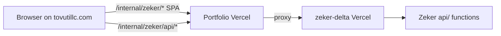

# Zeker at `/internal/zeker` (separate repo, same domain)

Zeker (`api-manager`) stays in its own GitHub repo and Vercel project. The **portfolio** site proxies path traffic to that deployment so users open:

`https://tovutillc.com/internal/zeker`

Standalone Zeker deployment (for smoke tests): `https://zeker-delta.vercel.app/internal/zeker`

## Why not copy source like ClientSync?

ClientSync lives under `src/clientsync/` and ships in the portfolio bundle. Zeker is larger, has its own Firebase project, Vercel API routes, and auth — keep it separate.

## Critical: API path conflict

The portfolio serves `/api/admin/*`, `/api/onboarding/*`, `/api/forms/*`.

Zeker must **not** call root `/api/*` on `tovutillc.com` or those routes collide.

**Solution:** the app calls **`/internal/zeker/api/*`**. The portfolio rewrites that prefix to Zeker’s `/api/*` on `zeker-delta.vercel.app`. This repo also rewrites `/internal/zeker/api/*` → `/api/*` when users hit the Zeker deployment directly.

## Architecture (request flow)



Most data still goes **browser → Firebase** (Auth, Firestore, Storage). Only privileged ops use the API — see [`docs/backend/vercel-api.md`](backend/vercel-api.md).

## Deploy order

1. Deploy **this repo** (`zeker-delta` or your Vercel project) with the Zeker changes below.
2. Confirm `https://zeker-delta.vercel.app/internal/zeker/login` loads assets and login works.
3. Deploy the **portfolio** repo (rewrites already configured there).
4. Confirm `https://tovutillc.com/internal/zeker/login`.
5. Firebase Console → Authentication → **Authorized domains** → add `tovutillc.com`.

---

## Portfolio repo (external — already done)

Configured in the portfolio project (not this repo):

- `vercel.json` rewrites `/internal/zeker` and `/internal/zeker/api/*` → `https://zeker-delta.vercel.app`
- `/internal/home` hub links to CRM and Zeker
- Sitemap excludes `/internal/zeker`

To point at a different Zeker deployment, change the host in the portfolio `vercel.json` (search `zeker-delta.vercel.app`).

---

## Zeker repo (this project) — implementation reference

### Path helpers — [`src/config/paths.ts`](../src/config/paths.ts)

| Export | Purpose |
| ------ | ------- |
| `APP_BASE` | `/internal/zeker` (from Vite `base`) |
| `API_BASE` | `/internal/zeker/api` |
| `appPath(segment)` | Build in-app URLs under the base |

### Router — [`src/main.tsx`](../src/main.tsx)

`BrowserRouter` uses `basename={APP_BASE}` so routes in `App.tsx` stay `/login`, `/dashboard`, etc.

### Vite — [`vite.config.ts`](../vite.config.ts)

- `base: "/internal/zeker/"`
- Dev proxy: `/internal/zeker/api` → `http://127.0.0.1:3000`, rewritten to `/api` for `vercel dev`

### API client — [`src/services/apiClient.ts`](../src/services/apiClient.ts)

- `resolveApiUrl("/api/...")` → `/internal/zeker/api/...`
- `apiPostJson` uses `resolveApiUrl` for all POSTs

**Call sites (pass logical `/api/...` paths; resolution is automatic):**

| Area | File |
| ---- | ---- |
| Rate limit (login) | [`src/stores/rateLimitStore.ts`](../src/stores/rateLimitStore.ts) |
| Tag merge | [`src/stores/tagStore.ts`](../src/stores/tagStore.ts) |
| Cancel subscription | [`src/pages/SubscriptionManagementPage.tsx`](../src/pages/SubscriptionManagementPage.tsx) |

Stripe webhook is server-to-server only (`/api/stripe-webhook`), not called from the SPA.

### Vercel rewrites — [`vercel.json`](../vercel.json)

Order matters (specific routes first):

1. `/api/*` → Vercel Functions
2. `/internal/zeker/api/*` → `/api/*` (direct hits on Zeker deployment)
3. `/internal/zeker/assets/*` → `/dist/assets/*`
4. `/internal/zeker` and `/internal/zeker/*` → `/dist/index.html` (SPA)
5. `/` → redirect **308** to `/internal/zeker`

### Firebase / Stripe

- **Firebase Auth:** add `tovutillc.com` to authorized domains.
- **Stripe:** webhook URL stays on the Zeker project (`https://zeker-delta.vercel.app/api/stripe-webhook` or custom domain). Billing return URLs in Stripe Dashboard should include `https://tovutillc.com/internal/zeker/pro/billing/...` if users checkout from the portfolio path.
- **CORS** ([`cors.json`](../cors.json)): add `https://tovutillc.com` if Storage uploads fail from that origin.

### Local development

Terminal 1 — frontend:

```bash
npm run dev
# http://localhost:5173/internal/zeker/
```

Terminal 2 — API:

```bash
vercel dev
# :3000 — Vite proxies /internal/zeker/api → /api
```

Portfolio local dev does not proxy Zeker unless you add a matching `server.proxy` there; use the Zeker dev URL while working in this repo, then verify the combined path after both deploys.

---

## Verification checklist

- [ ] `zeker-delta.vercel.app/internal/zeker/login` — CSS/JS load (no 404 on `/internal/zeker/assets/*`)
- [ ] Login works on `zeker-delta.vercel.app` and `tovutillc.com`
- [ ] Network tab: API calls go to `/internal/zeker/api/...` (not root `/api/...` on portfolio domain)
- [ ] Tag merge and rate-limit routes return 200
- [ ] `tovutillc.com/internal/zeker/dashboard` when signed in
- [ ] Portfolio `/api/admin/me` still works (no regression)

## Troubleshooting

| Symptom | Likely cause |
|--------|----------------|
| Blank page, 404 on assets | `base` missing in Vite or `/internal/zeker/assets` rewrite missing in `vercel.json` |
| Login works on `zeker-delta` but not on `tovutillc.com` | Firebase authorized domain missing |
| API 404 on production domain | `fetch` still uses `/api/*` instead of `resolveApiUrl` / `apiPostJson` |
| API 404 on `zeker-delta` only | Missing `/internal/zeker/api/*` → `/api/*` rewrite on Zeker deployment |
| Portfolio onboarding API broken | Zeker routed at root `/api/*` on portfolio — portfolio must only proxy `/internal/zeker/api/*` |

## Related docs

- [Vercel API routes](backend/vercel-api.md) — env vars, route list, backend migration notes
